# ClinicPro — Full Technical Report & Interview Preparation Guide

**Project:** ClinicPro (Hospital / Clinic Management System)  
**Course context:** Semester 3 — Database Management Systems  
**Stack:** MySQL · Node.js / Express · Bootstrap (HTML/JS) · Firebase Hosting · Railway  
**Repository:** https://github.com/ThevinduFernando2003/Hospital-Management-System

Use this document to:

1. Explain the system end-to-end in interviews or viva exams  
2. Defend design decisions (DBMS + software engineering)  
3. Answer security, failure-mode, and “what would you improve?” questions  
4. Walk through architecture diagrams and operational pipelines  

---

# Part 1 — Executive Summary

**ClinicPro** is a multi-branch clinic management system that digitizes:

- Staff / role accounts and branch operations  
- Doctor specialties and weekly availability  
- Patient registration and appointments  
- Visit completion (notes + treatments)  
- Invoice generation, payments, and insurance claims  
- Management reporting via SQL views and Chart.js dashboards  

It is intentionally **database-centric**: critical business rules (no double-booking, no overpayment, protected deletes, DOB validation) live in **MySQL triggers and a stored procedure**, not only in application code. The Express API enforces **JWT + role-based access control (RBAC)**. The UI is a set of role-specific Bootstrap portals.

**Product branding in the UI:** ClinicPro  
**Sample clinic brand in seed data:** MedSync (Colombo, Kandy, Galle)

---

# Part 2 — Problem Statement & Scope

## 2.1 Problem

Small multi-branch clinics often struggle with:

- Double-booked doctors  
- Fragmented patient and billing records  
- Weak audit of reschedules  
- Manual invoice math with insurance coverage  
- No role separation (everyone uses the same screen / password sharing)

## 2.2 In-scope

| Module | In scope |
|--------|----------|
| Multi-branch org model | Yes |
| RBAC portals (Admin, Reception, Doctor, Branch Manager) | Yes |
| Appointments + availability | Yes |
| Treatments + invoicing + payments | Yes |
| Insurance providers / claims data model | Yes |
| SQL reporting views + dashboards | Yes |
| Patient REST APIs | Yes (backend) |

## 2.3 Out of scope / honest limits

| Topic | Status |
|-------|--------|
| Full hospital wards / beds / labs / pharmacy | Not implemented (clinic-focused) |
| Patient web portal UI | APIs only; no dedicated HTML page |
| Electronic health record (full EMR) | Consultation notes + treatment history only |
| Real payment gateway (Stripe/PayHere) | Manual payment recording |
| Layered backend (controllers/services/repos) | Monolithic `server.js` |
| Automated test suite | Not present |

**Interview tip:** Saying what you *did not* build shows maturity. Always pair it with how you would extend it.

---

# Part 3 — System Architecture

## 3.1 High-level architecture

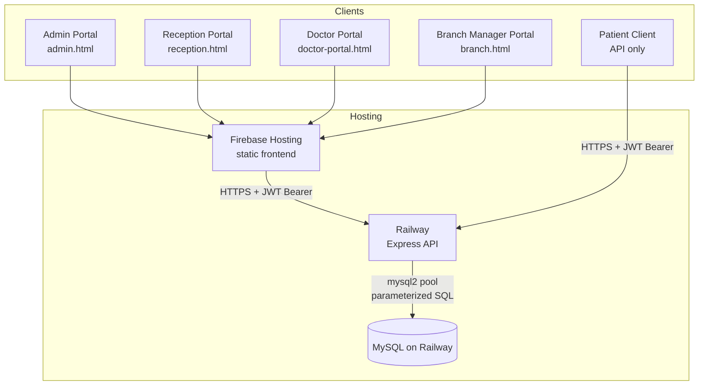

## 3.2 Logical layers

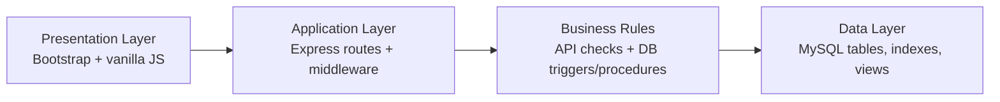

| Layer | Responsibility in ClinicPro |
|-------|-----------------------------|
| Presentation | Login, role dashboards, forms, Chart.js, `localStorage` JWT |
| Application | REST endpoints, `authorize([...roles])`, transactions |
| Business rules | Overlap checks, invoice calc, status updates (DB-heavy) |
| Data | Normalized schema, FKs, indexes, views |

## 3.3 Deployment topology

| Component | Where | Notes |
|-----------|-------|-------|
| Frontend | Firebase Hosting (`public: frontend`) | SPA rewrite → `index.html` |
| Backend | Railway (`hms-production-a5ad.up.railway.app`) | Express listens `0.0.0.0:PORT` |
| Database | MySQL on Railway | Loaded via `database.sql` / `run-sql.js` |
| Secrets | Environment variables | `JWT_SECRET`, `MYSQL_*` — not committed |

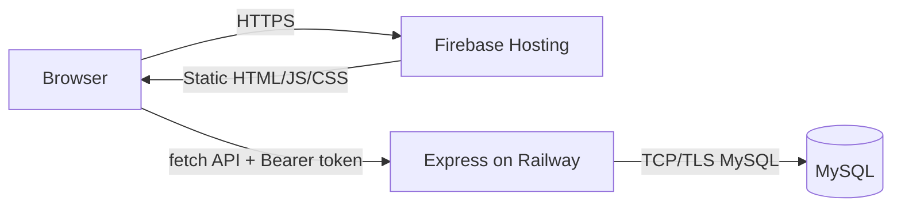

---

# Part 4 — Why This Tech Stack?

Interviewers love “why not X?” questions. Use the table below.

## 4.1 Decision matrix

| Choice | Why we chose it | Alternatives considered | Trade-off |
|--------|-----------------|-------------------------|-----------|
| **MySQL** | Strong relational model for clinics; excellent for FKs, triggers, procedures, views — perfect for a DBMS course | PostgreSQL, SQL Server | Postgres has richer JSON/types; MySQL is widely taught and well supported on Railway |
| **Triggers / procedure / views** | Enforce rules even if a buggy client skips validation; demonstrate advanced SQL | App-only validation | Triggers can be hard to debug; logic split between app and DB |
| **Node.js + Express** | Same language as frontend JS; fast to build REST; huge ecosystem | FastAPI, Spring Boot, ASP.NET | Single-threaded event loop — CPU-heavy work needs care |
| **mysql2 (promise pool)** | Async queries; connection pooling; prepared statements | Sequelize/Prisma ORM | Raw SQL = more control for DBMS learning; less abstraction |
| **JWT + bcrypt** | Stateless auth for multi-portal SPA/static sites; industry standard | Sessions + cookies | JWT revocation is harder; XSS can steal tokens from `localStorage` |
| **Vanilla JS + Bootstrap** | Fast UI delivery for role portals; no build step; easy Firebase deploy | React/Vue/Angular | Harder to scale UI complexity; less component reuse |
| **Chart.js** | Lightweight charts for revenue/arrivals | D3, ECharts | Fine for dashboards; not a BI suite |
| **Firebase Hosting** | Free/cheap static hosting, HTTPS, CDN | Netlify, GitHub Pages | Frontend only — API still elsewhere |
| **Railway** | Simple deploy for Node + managed MySQL | Render, AWS EC2, Azure | Vendor lock / cost at scale; cold starts possible on free tiers |

## 4.2 Model answers: “Why not React / MongoDB / microservices?”

**Why not MongoDB?**  
Clinic data is highly relational (appointments → doctors → staff → branches; invoices → payments → claims). We need joins, referential integrity, and transactional multi-table updates. A document store would force us to re-implement those guarantees in application code.

**Why not React?**  
For a DBMS-focused semester project, UI complexity was secondary to schema correctness, triggers, and reporting. Bootstrap multi-page portals were enough to demonstrate role flows quickly. React would add build tooling without improving the learning outcomes of the course.

**Why not microservices?**  
A single Express service matches team size and domain coupling (appointment + invoice often share a transaction boundary). Microservices would add network failure modes without clear benefit at this scale.

---

# Part 5 — Database Design (Deep Dive)

## 5.1 ER-style overview

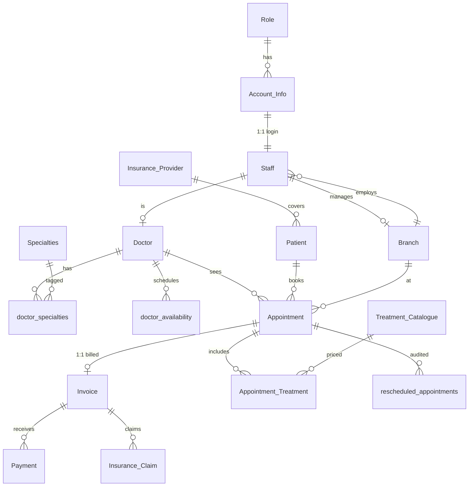

## 5.2 Normalization rationale (interview gold)

| Decision | Form / principle | Why |
|----------|------------------|-----|
| Separate `Account_Info` from `Staff` | Separation of auth vs HR attributes | Login credentials ≠ clinical employment record |
| `Doctor` as subtype of `Staff` | Subtype / 1:1 specialization | Not all staff are doctors; avoids nullable doctor fields on every staff row |
| `doctor_specialties` junction | M:N | A doctor can have many specialties |
| `Appointment_Treatment` junction | M:N + attributes | Treatments per visit with notes / actual price |
| `Invoice.appointment_id UNIQUE` | 1:1 | One bill per visit (business rule) |
| `rescheduled_appointments` | Audit entity | History of date changes without losing prior schedule |

**Typical viva question:** “What normal form is your schema in?”  
**Answer sketch:** Aim for **3NF** — non-key attributes depend on the whole key, not on other non-keys. Junction tables remove M:N repeating groups. We denormalize only for reporting via **views**, not by storing redundant revenue totals in base tables.

## 5.3 Indexes (performance talking points)

| Index | Purpose |
|-------|---------|
| `idx_appointment_schedule` | Date-range listing |
| `idx_appointment_status` | Filter Scheduled / Completed |
| `idx_appointment_doctor_date` | Doctor calendar + overlap trigger support |
| `idx_invoice_status` / `idx_invoice_due_date` | Outstanding / overdue reports |
| `idx_payment_date` | Payment history timelines |
| `unique_doctor_day` on availability | Prevent duplicate identical slots |

**Interview angle:** Triggers that scan `Appointment` by `doctor_id + schedule_date` benefit from `idx_appointment_doctor_date`. Without it, overlap checks degrade as appointments grow.

## 5.4 Triggers (all 10) — explain each

| Trigger | Event | Business rule |
|---------|-------|---------------|
| `PreventOverlappingAppointments` | BEFORE INSERT | No two active appointments for same doctor within **30 minutes** |
| `PreventOverlappingAppointmentsOnUpdate` | BEFORE UPDATE | Same rule when date changes |
| `PreventDoctorDeletionWithAppointments` | BEFORE DELETE Doctor | Block delete if future appointments exist |
| `UpdateInvoiceStatusAfterPayment` | AFTER INSERT Payment | Set invoice `Paid` / `Partially Paid` |
| `PreventOverpayment` | BEFORE INSERT Payment | Sum(payments) + new ≤ invoice total |
| `ValidatePatientDOB_Insert` / `_Update` | BEFORE INSERT/UPDATE Patient | DOB not future; not older than 120 years |
| `PreventTreatmentDeletion` | BEFORE DELETE Treatment | Block if used in `Appointment_Treatment` |
| `PreventSpecialtyDeletion` | BEFORE DELETE Specialty | Block if assigned to doctors |
| `PreventInsuranceDeletion` | BEFORE DELETE Insurer | Block if patients or claims reference it |

**How errors surface to the API:** Triggers raise `SIGNAL SQLSTATE '45000'`. Backend maps `err.sqlState === '45000'` to HTTP **409 Conflict** with the trigger message.

### Sample overlap logic (conceptual)

```sql
-- Pseudo: reject if another Scheduled/Rescheduled appointment
-- for same doctor is within 30 minutes
ABS(TIMESTAMPDIFF(MINUTE, schedule_date, NEW.schedule_date)) < 30
```

## 5.5 Stored procedure — `CalculateInvoiceFromTreatments`

**Inputs:** appointment_id, insurance_coverage, issued_date, due_date, initial_payment  
**Output:** invoice_id  

**Algorithm:**

1. `SUM(actual_price)` from `Appointment_Treatment`  
2. If sum = 0 → default consultation fee **80.00**  
3. `out_of_pocket = total - insurance_coverage`  
4. `due = out_of_pocket - initial_payment`  
5. Status: Paid / Partially Paid / Pending  
6. Insert `Invoice`; optionally insert initial `Payment`

**Why a procedure?** Invoice math must be consistent for every receptionist client. Putting it in MySQL centralizes the calculation and keeps it atomic with the insert.

## 5.6 Views (reporting layer)

| View | Used for |
|------|----------|
| `vw_branch_appointment_summary` | Branch load / emergencies by day |
| `vw_doctor_revenue` | Doctor / specialty revenue |
| `vw_patients_outstanding` | Due balances + Overdue/Pending |
| `vw_treatment_statistics` | Monthly treatment volume/revenue |
| `vw_insurance_analysis` | Coverage % by provider |

**SE idea:** Views are a **read model** — dashboards query views instead of duplicating complex joins in every endpoint.

---

# Part 6 — Backend Architecture

## 6.1 Structure

Single-file Express app: `backend/server.js` (~1,800 lines).

| Concern | Implementation |
|---------|----------------|
| Config | `dotenv` → `JWT_SECRET`, `MYSQL_*`, `PORT` |
| DB access | `mysql.createPool` — `connectionLimit: 10` |
| AuthN | Login → bcrypt compare → JWT (8h) |
| AuthZ | `authorize(['admin', ...])` middleware |
| Errors | `handleDatabaseError`; trigger → 409 |
| Multi-write ops | `pool.getConnection()` + `beginTransaction` / `commit` / `rollback` |

## 6.2 Auth pipeline

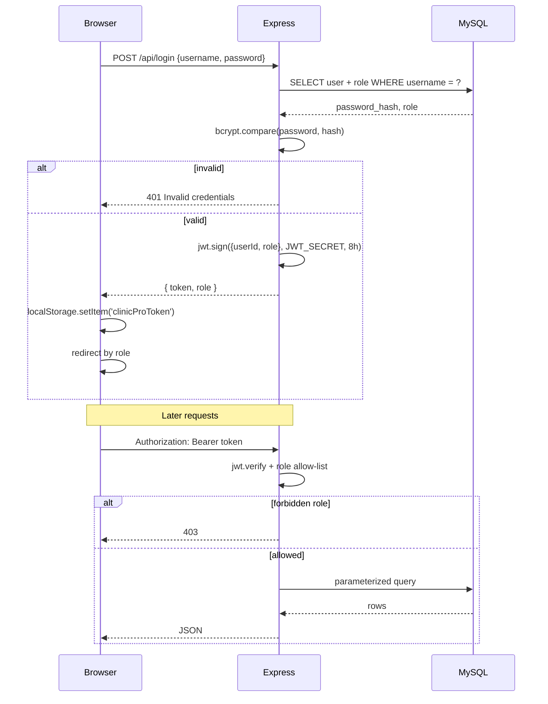

## 6.3 Role model

| Role | Typical permissions |
|------|---------------------|
| Admin | Global CRUD, stats, all reports |
| Receptionist | Branch-scoped patients, appointments, invoices, payments |
| Doctor | Own appointments, complete visit, availability, history |
| Branch Manager | Own branch staff/appointments/invoices/reports |
| Patient (API) | List doctors, book, view own appointments/documents |

## 6.4 Transactional endpoints (consistency)

Examples that use DB transactions:

- Create branch + manager account linkage  
- Create staff (+ optional doctor + specialties)  
- Reschedule appointment (+ audit row in `rescheduled_appointments`)  
- Create invoice via `CALL CalculateInvoiceFromTreatments`  
- Record payments  
- Doctor complete appointment (notes + treatments)

**Why transactions matter:** Without them, a crash mid-way could create `Account_Info` without `Staff`, or mark an appointment completed without treatments.

## 6.5 Availability → slot generation pipeline

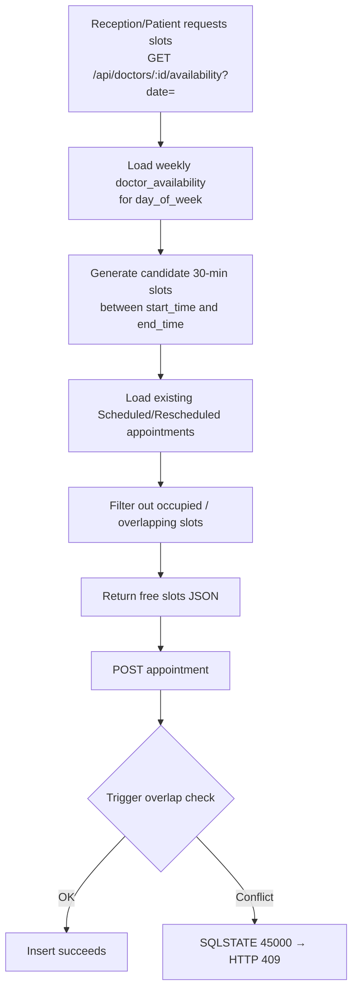

**Defense in depth:** Application filters slots **and** DB trigger still blocks races (two receptionists booking the last slot simultaneously).

---

# Part 7 — Frontend Architecture

## 7.1 Pages

| File | Role | Scripts |
|------|------|---------|
| `index.html` | Login | `login.js` |
| `admin.html` | Admin | `app.js` |
| `reception.html` | Receptionist | `reception.js` |
| `doctor-portal.html` | Doctor | `doctor-appointments.js` |
| `branch.html` | Branch Manager | `branch.js` |
| `style.css` | Shared styling | — |

## 7.2 Client auth pattern

1. Login stores JWT in `localStorage` as `clinicProToken`  
2. Role switch redirects to the correct portal  
3. Each portal attaches `Authorization: Bearer …` on `fetch`  
4. Production API base: Railway URL hardcoded in frontend JS  

## 7.3 UI patterns

- Bootstrap sidebars + modals + toasts  
- Chart.js for admin/branch revenue and arrivals  
- Search/filter tables for appointments and patients  

---

# Part 8 — End-to-End Business Pipelines

## 8.1 Pipeline A — New patient visit (happy path)

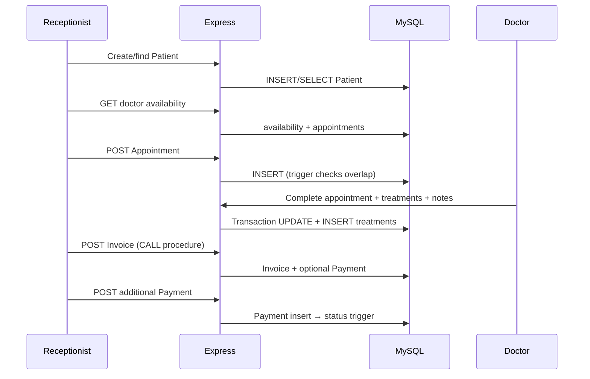

## 8.2 Pipeline B — Reschedule

1. Receptionist updates appointment date  
2. Backend transaction:  
   - Insert row into `rescheduled_appointments` (old date, new date, staff, reason)  
   - Update `Appointment.schedule_date` / status  
3. Update trigger re-validates 30-minute overlap  

## 8.3 Pipeline C — Billing & insurance

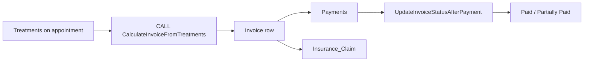

## 8.4 Pipeline D — Reporting

1. Nightly/continuous data lands in base tables  
2. Managers open dashboard  
3. API queries views (`/api/reports/:reportName` or branch-specific report endpoints)  
4. Chart.js renders series (monthly revenue, branch revenue, etc.)

---

# Part 9 — Security Measures

## 9.1 What we implemented

| Control | How |
|---------|-----|
| Password hashing | `bcryptjs` — store `password_hash`, never plaintext |
| Stateless auth | JWT signed with `JWT_SECRET`, expiry **8 hours** |
| Route authorization | `authorize(allowedRoles)` → 401/403 |
| Secrets management | `.env` + process env; JWT missing → process exit |
| SQL injection mitigation | Parameterized queries (`?` placeholders) via mysql2 |
| Branch scoping | Receptionists filtered to their `branch_id` for lists/ops |
| CORS enabled | `app.use(cors())` for cross-origin frontend → API |
| Trigger hard rules | Even a compromised/buggy client cannot easily overpay or double-book |

## 9.2 Threat model (interview style)

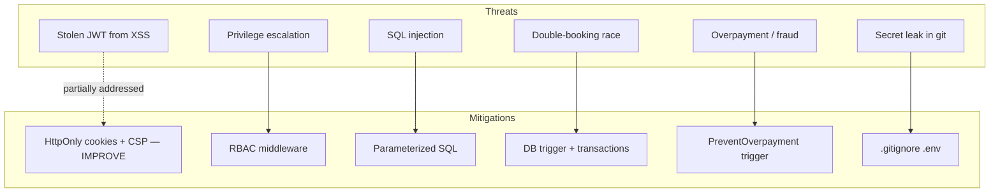

## 9.3 Security gaps (say these yourself — interviewers respect honesty)

| Gap | Risk | Better practice |
|-----|------|-----------------|
| JWT in `localStorage` | XSS can steal token | Prefer **HttpOnly Secure SameSite cookies** |
| `cors()` wide open | Any origin can call API | Whitelist Firebase / known origins |
| Patient login scheme (derived password) | Weak / predictable if pattern known | Proper patient accounts + email OTP / reset |
| No rate limiting on `/api/login` | Brute force | express-rate-limit + lockouts |
| No refresh-token / revocation list | Stolen JWT valid until expiry | Short access tokens + refresh + blacklist |
| Error messages may leak DB details | Info disclosure | Generic 500 to clients; log server-side only |
| No HTTPS enforcement in app code | MITM if misconfigured | Always terminate TLS at host (Firebase/Railway do this in prod) |
| Monolithic secrets in one env | Blast radius | Rotate JWT secret; least-privilege DB user |
| No audit log for admin deletes | Forensics weak | Append-only audit table |
| HIPAA/GDPR not fully addressed | Legal/compliance | Encryption at rest, consent, retention policies |

## 9.4 Defense in depth philosophy (great spoken answer)

> “We validate in the UI for UX, enforce RBAC in the API for authorization, and **still** put non-negotiable financial and scheduling invariants in MySQL triggers so the database is the last line of defense.”

---

# Part 10 — Failure Modes & Where the System Can Break

## 10.1 Technical failure modes

| Failure | Symptom | Root cause | Mitigation / recovery |
|---------|---------|------------|------------------------|
| Railway API down | Frontend login fails | Host outage / crash | Health checks, process manager, multi-instance |
| MySQL connection exhaustion | Random 500s | Pool too small / leaked connections | Pool limits, timeouts, monitor `Threads_connected` |
| Trigger rejection | 409 on book/pay | Business rule conflict | Show trigger message to user; pick another slot |
| Partial write without transaction | Orphan account/staff | Missing transaction | Always wrap multi-table writes |
| Clock skew / timezone | Wrong day slots | DATETIME vs local TZ | Store UTC; convert in UI |
| Concurrent last-slot booking | One user gets 409 | Race won by DB | Retry UX; optimistic messaging |
| JWT secret rotated | All users logged out | Deploy changed secret | Planned rotation + re-login |
| Hardcoded API URL | Local frontend hits prod | Config not environment-based | `API_BASE_URL` per env |
| Firebase rewrite to index | Deep links OK; API not on Firebase | Wrong host | Keep API on Railway only |

## 10.2 Domain / product failure modes

| Scenario | Why it fails today | Fix direction |
|----------|--------------------|---------------|
| Doctor late / walk-ins | Rigid 30-min grid | Buffer slots, emergency queue |
| Multi-currency / tax | Single DECIMAL amounts | Tax rules table |
| Insurance claim lifecycle | Status field only | Claim state machine + documents |
| No inventory / pharmacy | Out of scope | New module + stock triggers |
| Cross-branch doctor | Availability per doctor, branch on appointment | Explicit visiting-consultant rules |

## 10.3 Scalability limits

| Bottleneck | Approx concern | Scale path |
|------------|----------------|------------|
| Single `server.js` process | CPU / deploy risk | Split routes; horizontal replicas behind load balancer |
| Large appointment table | Trigger scans | Partition by date; keep indexes warm |
| Chart endpoints aggregating live | Heavy GROUP BY | Materialized summary tables / cache |
| Static frontend calling one region | Latency | CDN already (Firebase); API edge later |

---

# Part 11 — Software Engineering Practices Applied

Even in a student project, call out SE concepts explicitly.

| SE concept | How ClinicPro uses it |
|------------|------------------------|
| Requirements → modules | Roles map to portals and API groups |
| Layered architecture | UI → API → DB |
| Separation of concerns | Auth middleware vs business routes vs SQL objects |
| Data integrity | FKs + triggers + transactions |
| Defense in depth | Client checks + API RBAC + DB constraints |
| Auditability | `rescheduled_appointments` |
| Observability (basic) | `console.error` on DB errors |
| Configuration management | dotenv / Railway env vars |
| Deployment pipeline | Git → Railway (API) + Firebase (frontend) |
| Documentation | `README.md`, `database.sql` comments, this guide |

### Suggested SDLC narrative for interviews

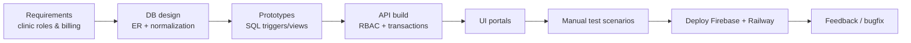

---

# Part 12 — Testing Scenarios (Manual / Viva Demos)

Prepare to demo these live:

1. **Login as each role** → correct redirect  
2. **Receptionist books overlapping slot** → rejected (409 / message)  
3. **Complete visit with treatments** → uninvoiced list updates  
4. **Create invoice with insurance + initial payment** → status Partially Paid / Paid  
5. **Pay more than due** → overpayment blocked  
6. **Delete treatment used in history** → blocked by trigger  
7. **Branch manager sees only branch metrics**  
8. **Reschedule** → audit row appears  

---

# Part 13 — Interview Question Bank

Answers are **model sketches** — speak them in your own words; add what *you* personally built.

---

## A. Project overview (warm-up)

### Q1. Explain your project in 60 seconds.
**A:** ClinicPro is a multi-branch clinic management system. We designed a MySQL schema with triggers and a billing stored procedure, exposed it through an Express JWT API, and built Bootstrap portals for admin, reception, doctors, and branch managers. It’s deployed on Firebase and Railway.

### Q2. What was your role / contribution?
**A:** *[Fill in honestly — e.g. schema + triggers, billing procedure, reception APIs, doctor portal, deployment.]*

### Q3. Why is this a DBMS project and not just a web app?
**A:** The hardest correctness rules live in the database: overlap prevention, overpayment prevention, protected deletes, invoice calculation procedure, and analytical views. The web app is a client of those guarantees.

### Q4. Who are the users?
**A:** Admin, Receptionist, Doctor, Branch Manager; patient APIs exist for booking/documents.

---

## B. Architecture & tech stack

### Q5. Draw the architecture.
**A:** Use the mermaid diagram in Part 3 — Browser → Firebase static UI → Railway Express → MySQL.

### Q6. Why MySQL over MongoDB?
**A:** See §4.2 — relational integrity, joins, transactions, triggers.

### Q7. Why Express over Spring / Django?
**A:** Team familiarity with JS, rapid REST development, lightweight for CRUD + SQL-centric domain.

### Q8. Why not an ORM?
**A:** Course goal was SQL mastery (joins, views, CALL procedure). mysql2 prepared statements keep us close to the database while still safe from injection.

### Q9. How do you deploy?
**A:** Frontend to Firebase Hosting; API + MySQL on Railway; secrets via env vars.

### Q10. What happens if the API restarts?
**A:** JWTs remain valid until expiry (stateless). In-flight transactions roll back. Clients retry failed requests.

---

## C. Database deep questions

### Q11. Walk through your ER model.
**A:** Start from Role → Account → Staff → Doctor; Branch; Patient; Appointment hub; treatments; Invoice 1:1; Payment/Claim.

### Q12. What is the cardinality of Invoice to Appointment?
**A:** **One-to-one** — `appointment_id UNIQUE` on Invoice.

### Q13. How did you model doctor specialties?
**A:** M:N via `doctor_specialties`.

### Q14. Explain one trigger in detail.
**A:** Pick overlap: BEFORE INSERT counts conflicting Scheduled/Rescheduled appointments within 30 minutes; SIGNAL 45000 if found.

### Q15. Why BEFORE INSERT for overpayment but AFTER INSERT for status update?
**A:** Overpayment must **stop** the write → BEFORE. Status update needs the new payment row visible in SUM → AFTER.

### Q16. What does SQLSTATE 45000 mean?
**A:** User-defined exception in MySQL; we use it for business-rule failures.

### Q17. Explain the invoice stored procedure.
**A:** See §5.5 — sum treatments, default fee, insurance, due, insert invoice/payment.

### Q18. Difference between VIEW and TABLE?
**A:** View is a stored SELECT (virtual/read model). We use views for reporting without denormalizing base tables.

### Q19. What indexes did you add and why?
**A:** Appointment schedule/doctor/status; invoice due/status; payment date — to speed filters and support trigger lookups.

### Q20. How do you handle the circular FK between Branch and Staff (manager)?
**A:** Create Branch without manager FK first, create Staff, then `ALTER TABLE Branch ADD CONSTRAINT fk_branch_manager`.

### Q21. ON DELETE behaviors — give examples.
**A:** Patient delete cascades appointments; doctor delete on appointment is SET NULL but blocked by trigger if future appts exist; insurance on patient SET NULL.

### Q22. Is your schema normalized? Any denormalization?
**A:** Base tables aim at 3NF. Reporting denormalization is avoided by using views.

### Q23. How would you prevent phantom double-booking under concurrency?
**A:** Trigger is necessary but not always sufficient alone; discuss transactions + unique constraints / locking. Our trigger + short transactions reduce the window; serializable isolation or advisory locks could harden further.

### Q24. What is the default consultation fee and why?
**A:** 80.00 when no treatments recorded — ensures every completed visit can still be billed.

---

## D. Backend / API

### Q25. How does authorization work?
**A:** JWT payload includes `role`; middleware checks allow-list; mismatch → 403.

### Q26. Difference between 401 and 403 in your API?
**A:** 401 = missing/invalid token; 403 = valid token but wrong role / branch assignment.

### Q27. How do you prevent SQL injection?
**A:** Parameterized queries only; never string-concatenate user input into SQL.

### Q28. Show a transactional flow.
**A:** Staff create: insert Account_Info → Staff → optional Doctor → specialties; commit or rollback.

### Q29. How is receptionist data scoped?
**A:** Resolve `branch_id` from Staff via token `userId`; filter doctors/branches/patients/appointments accordingly.

### Q30. How do doctor routes know which doctor is calling?
**A:** `getDoctorInfoFromToken` maps `userId` → staff → doctor_id.

### Q31. What is connection pooling? Why 10?
**A:** Reuse DB connections to avoid handshake cost. 10 is a starting limit for a small app; tune under load.

### Q32. How do you call a stored procedure from Node?
**A:** `CALL CalculateInvoiceFromTreatments(?,?,?,?,?,@invoice_id)` then `SELECT @invoice_id` (pattern used in invoice create).

---

## E. Frontend

### Q33. How does role-based navigation work?
**A:** Login response `role` → switch to `admin.html` / `reception.html` / `doctor-portal.html` / `branch.html`.

### Q34. Where is the token stored? Pros/cons?
**A:** `localStorage` — simple but XSS-sensitive; HttpOnly cookies safer.

### Q35. Why Chart.js?
**A:** Quick declarative charts for monthly/branch revenue without heavy BI tooling.

### Q36. Why multi-page instead of SPA framework?
**A:** Simpler hosting and clear role separation; sufficient for course scope.

---

## F. Security grilling

### Q37. How are passwords stored?
**A:** bcrypt hashes in `Account_Info.password_hash`.

### Q38. What if JWT_SECRET leaks?
**A:** Attacker can forge tokens. Rotate secret, force re-login, audit access; store secrets only in host env.

### Q39. Can a receptionist call admin stats?
**A:** No — `/api/stats/*` is `authorize(['admin'])` → 403.

### Q40. CORS risks?
**A:** Open CORS allows browser calls from any origin; pair with JWT still required, but CSRF/token theft risks rise — whitelist origins.

### Q41. How do you protect PHI (patient health info)?
**A:** Today: authz + TLS in production hosting. Missing: field encryption, audit trails, strict logging redaction, retention policy — discuss as future work.

### Q42. Rate limiting?
**A:** Not implemented — acknowledge and propose login throttling.

---

## G. Failure & improvement questions

### Q43. What is the weakest part of the system?
**A:** Pick honestly — e.g. monolithic `server.js`, JWT in localStorage, weak patient auth, lack of automated tests.

### Q44. How would you add a patient mobile app?
**A:** Reuse patient REST APIs; improve auth (OTP); push notifications for reminders.

### Q45. How would you add automated tests?
**A:** DB integration tests for triggers/procedure; API tests with supertest; seed a test schema.

### Q46. How would you migrate to React?
**A:** Keep API contract stable; rebuild portals as routes; move token handling to auth context; env-based API URL.

### Q47. How would you scale to 100 branches?
**A:** Read replicas for reports; partition appointments; cache lists; horizontal API; consider region affinity.

### Q48. What monitoring would you add?
**A:** Request latency, 5xx rate, DB pool wait time, trigger conflict rate (409s), login failures.

---

## H. Advanced / trap questions

### Q49. Triggers vs application validation — which wins?
**A:** Both. App for UX; DB for integrity. Never trust the client alone.

### Q50. Can a trigger replace all business logic?
**A:** No — workflows, auth, email notifications, complex orchestration stay in the app. Triggers for **invariants**.

### Q51. What isolation level do you assume?
**A:** MySQL InnoDB default REPEATABLE READ. Discuss dirty writes vs phantom reads for booking races.

### Q52. Why is Invoice separate from Payment?
**A:** One invoice, many partial payments — classic header/line financial modeling.

### Q53. How do views interact with UPDATE?
**A:** Our views are for read/reporting; we don’t update through them.

### Q54. What happens if insurance_coverage > total_amount?
**A:** Current procedure can produce negative out-of-pocket — **known gap**. Should clamp coverage ≤ total (good “improvement” answer).

### Q55. How is emergency appointment represented?
**A:** `Appointment.is_emergency` boolean; included in branch summary view aggregates.

---

## I. Behavioral / SE process

### Q56. Hardest bug you faced?
**A:** Prepare a real story — e.g. circular FK Branch↔Staff, trigger vs API double validation, receptionist branch filter, timezone slot bugs.

### Q57. How did the team collaborate?
**A:** Git branches, role-owned modules (DB / API / portals), merge to main, deploy.

### Q58. If you restarted the project, what would you change first?
**A:** Split backend modules, add tests for triggers, env-based frontend config, cookie auth.

---

# Part 14 — Quick “Whiteboard” Cheatsheet

Memorize these numbers:

| Item | Count / value |
|------|----------------|
| Tables | **17** |
| Triggers | **10** |
| Stored procedures | **1** (`CalculateInvoiceFromTreatments`) |
| Views | **5** |
| Staff roles in UI | **4** (+ patient API) |
| Slot granularity | **30 minutes** |
| Default consult fee | **80.00** |
| JWT expiry | **8 hours** |
| Pool size | **10** connections |

**One-sentence integrity story:**  
> “Scheduling and money cannot be wrong even if the UI is wrong — triggers and the invoice procedure enforce that in MySQL.”

---

# Part 15 — Glossary

| Term | Meaning in ClinicPro |
|------|----------------------|
| RBAC | Role-based access control via JWT role claim |
| Pool | Reused MySQL connections |
| SIGNAL 45000 | Custom business error from trigger |
| OOP | Out-of-pocket amount after insurance |
| Portal | Role-specific HTML dashboard |
| Seed data | Sample MedSync branches / staff / patients in `database.sql` |

---

# Part 16 — Suggested 10-Minute Presentation Script

1. **Problem** (30s) — multi-branch clinic ops & billing integrity  
2. **Architecture diagram** (1 min) — Firebase → Express → MySQL  
3. **ER highlights** (2 min) — Doctor subtype, appointment hub, invoice 1:1  
4. **Live integrity demos** (3 min) — overlap + overpayment triggers  
5. **Procedure + views** (1.5 min) — invoice calc + dashboard  
6. **Security** (1 min) — bcrypt, JWT RBAC, parameterized SQL, gaps  
7. **Future work** (1 min) — tests, cookie auth, patient app, claim workflow  

---

# Part 17 — Future Work Roadmap

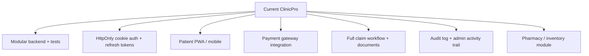

---

# Appendix A — Key Files Map

| Path | Why it matters |
|------|----------------|
| `database.sql` | Schema, triggers, procedure, views, seeds |
| `backend/server.js` | Entire API + auth + transactions |
| `frontend/login.js` | Auth entry + role redirect |
| `frontend/reception.js` | Booking / billing UX |
| `frontend/doctor-appointments.js` | Complete visit + availability |
| `frontend/app.js` | Admin dashboards/CRUD |
| `frontend/branch.js` | Branch manager analytics |
| `firebase.json` | Hosting config |
| `run-sql.js` | DB bootstrap helper |
| `README.md` | Setup guide |

---

# Appendix B — Practice Drill (answer out loud)

Set a timer for 45 minutes and answer without notes:

1. Explain architecture with a diagram  
2. Justify MySQL + triggers  
3. Trace booking from UI to trigger  
4. Trace payment to invoice status  
5. List 5 security controls and 5 gaps  
6. Explain one transaction  
7. Explain one view used in a report  
8. What fails at 10× load?  
9. What would you rewrite in semester 2 of this project?  
10. Demo pitch in 60 seconds  

---

**Document version:** 1.0  
**Purpose:** Technical report + interview / viva preparation for ClinicPro  
**Related:** See also `README.md` for setup instructions  

*End of document.*
